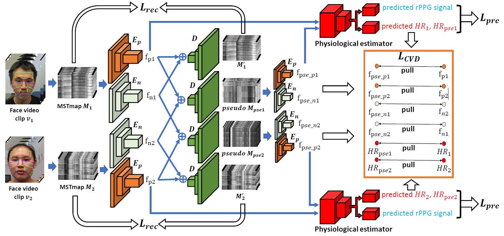

# CVD-Physiological-Measurement

This is the source code for paper

[Video-based Remote Physiological Measurement via Cross-verified Feature Disentangling.](https://arxiv.org/abs/2007.08213) (Oral)  
[Xuesong Niu](https://nxsedson.github.io/), Zitong Yu, Hu Han, Xiaobai Li, Shiguang Shan, Guoying Zhao  
European Conference on Computer Vision (ECCV), 2020.  

## Environment

This code is based on Matlab2018b, Python2.7 and Pytorch 0.4.1

## Data

For the VIPL-HR database, please refer to [this link](https://vipl.ict.ac.cn/view_database.php?id=15). An extension version of the VIPl-HR database (VIPL-HR-V2) can be found from [this link.](https://vipl.ict.ac.cn/view_database.php?id=17). For the OBF database, please contact [Xiaobai Li](https://www.oulu.fi/university/researcher/xiaobai-li) for more information.

## Data Processing 
The MSTmap generation procedure is based on Matlab. Please see the MSTmap_generation folder for more information. Both the [SeetaFaceEngine](https://github.com/seetaface/SeetaFaceEngine) (81 landmarks) and [OpenFace](https://github.com/TadasBaltrusaitis/OpenFace) (68 landmarks) facial landmarks detection engines are supported.

## Training
This code is only an toy example of the training procedure. You need to adjust the Dataloader and training and test function based on your own data.

## Contact
If you have any problems or any further interesting ideas with this project, feel free to contact me (xuesong.niu@vipl.ict.ac.cn).

## If you use this work, please cite our paper

    @inproceedings{niu2020CVD,
    title={Video-based Remote Physiological Measurement via Cross-verified Feature Disentangling.},
    author={Niu, Xuesong and Yu, Zitong and Han, Hu and Li, Xiaobai and Shan, Shiguang and Zhao, Guoying},
    booktitle= {European Conference on Computer Vision (ECCV)},
    year={2020}
    }
